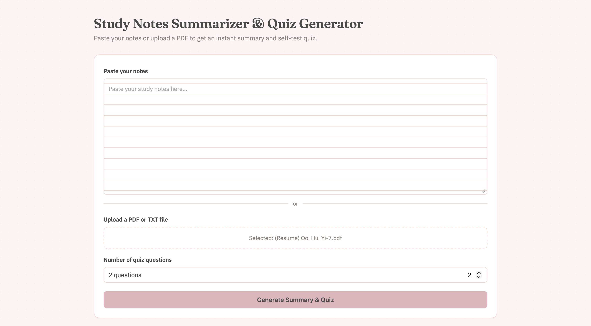
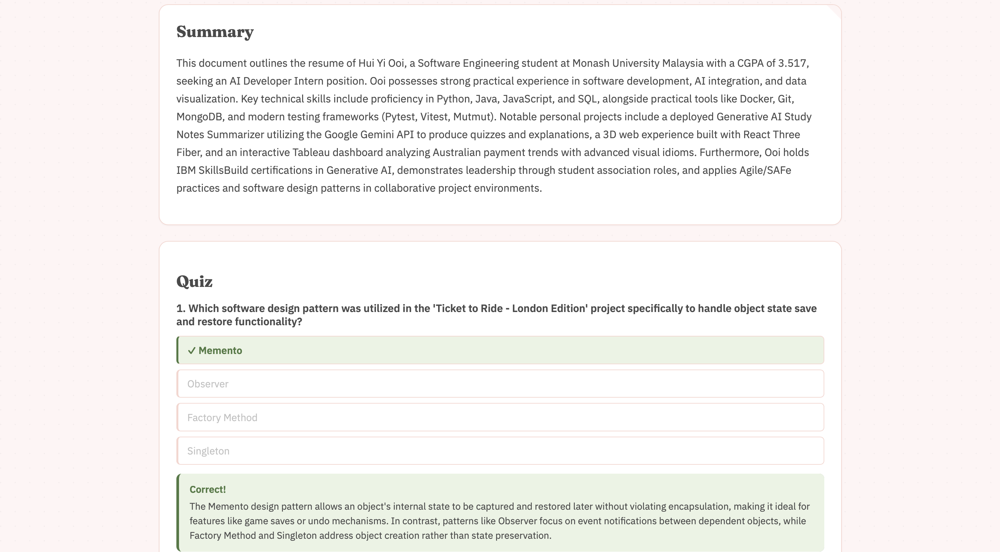

# Study Notes Summarizer & Quiz Generator

A full-stack web app that takes a student's notes (pasted text or an
uploaded PDF/TXT file) and uses the Google Gemini API to generate:

1. A concise summary
2. An interactive multiple-choice self-test quiz
3. Detailed explanations for correct and incorrect quiz options to reinforce learning

Built as a portfolio project to demonstrate LLM API integration, structured
prompting, a working backend, and a clean React frontend.

## Live Demo
* **Frontend:** [https://study-note-summarizer.vercel.app](https://study-note-summarizer.vercel.app) (Vercel)
* **Backend API:** Hosted on Render

## Tech Stack
- **Frontend:** React (Vite)
- **Backend:** Node.js + Express
- **AI:** Google Gemini API (free tier via Google AI Studio)
- **File handling:** pdf-parse, multer
- **Testing:** Vitest + Supertest

## How It Works
1. User pastes notes or uploads/drop a PDF/TXT file.
2. If a file was uploaded, the backend extracts raw text from it.
3. The backend sends the text to Gemini with a structured prompt requesting
   a summary and a JSON array of quiz questions.
4. The backend parses and validates the JSON response.
5. The React frontend renders the summary and an interactive quiz.
6. User completes the quiz and review detailed explanations for each question.

## Project Structure
```
study-notes-summarizer/
├── client/    React frontend
├── server/    Express backend
└── README.md
```

## Setup Instructions

### 1. Clone the repo
```bash
git clone https://github.com/kelechaohaohe/study-note-summarizer.git 
cd study-note-summarizer
```

### 2. Backend setup
```bash
cd server
npm install
cp .env.example .env
# Edit .env and add your GEMINI_API_KEY (from https://aistudio.google.com/apikey)
npm run dev
```
The server runs on http://localhost:5001

### 3. Frontend setup (in a new terminal)
```bash
cd client
npm install
cp .env.example .env
npm run dev
```
The app runs on http://localhost:5173

### 4. Run backend tests
```bash
cd server
npm test
```

## Environment Variables

**server/.env**
| Variable | Description |
|---|---|
| `GEMINI_API_KEY` | Your free Google Gemini API key |
| `PORT` | Port for the Express server (default 5001) |
| `CLIENT_ORIGIN` | Frontend URL, for CORS |

**client/.env**
| Variable | Description |
|---|---|
| `VITE_API_URL` | URL of the deployed backend |

## Screenshot



## License
MIT
